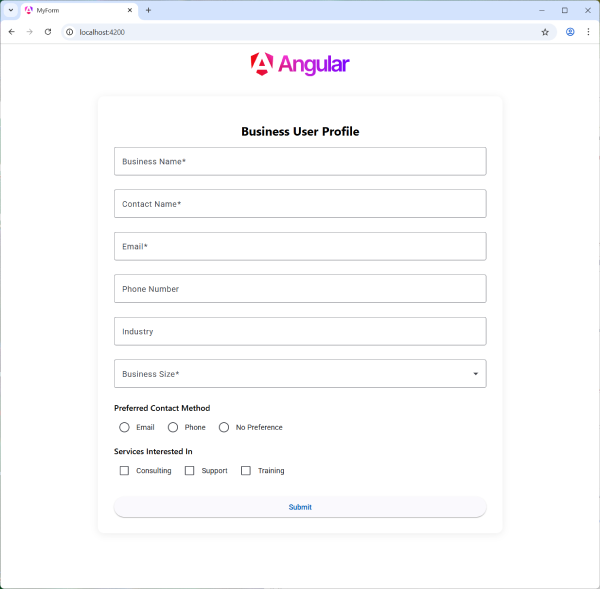
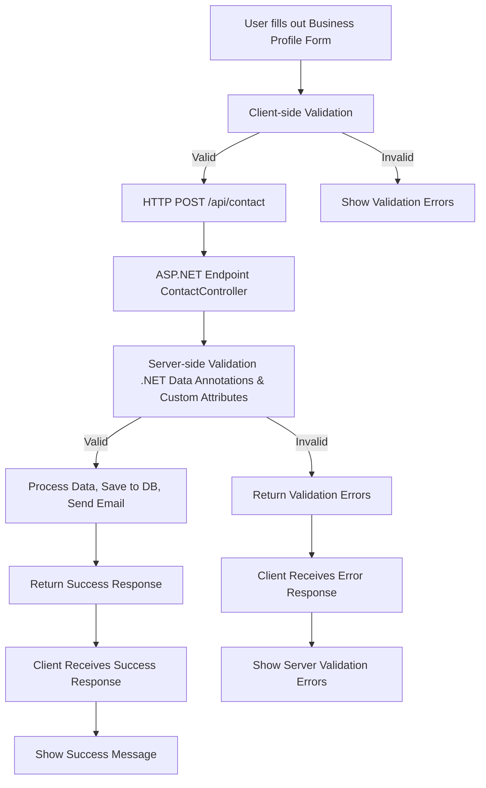

# Business Application Form Demo

A full-stack business application form demo with **Angular 20** (client) and **ASP.NET Core** (server).
This project demonstrates a modern, responsive business profile form with Angular Material UI, advanced CSS, and robust **server-side validation**.



---

## Project Overview

- **Purpose:**
  - Provide a practical example of a business user profile form with real-world validation and full-stack integration.

- **Features:**
  - Responsive Angular 20 client using Material Design components.
  - Text fields, dropdowns, radio buttons, and checkboxes.
  - Custom CSS for clean, maintainable, and responsive design.
  - **Client-side validation** for required fields and input constraints.
  - **Server-side validation** using ASP.NET Core data annotations and custom validation attributes.
  - Clear error messages returned from the server for invalid submissions.
  - Example of full-stack form handling and validation.

---

## Getting Started

### Prerequisites

- Node.js & npm
- .NET 8 SDK (or compatible)

### Running the Client

```bash
cd client
ng serve
```
Open your browser at [http://localhost:4200/](http://localhost:4200/).

### Running the Server

```bash
cd server
dotnet run
```
The API will be available at [http://localhost:5051/api/contact](http://localhost:5051/api/contact).

---

## Building the Project

### Client

```bash
cd client
ng build
```

### Server

```bash
cd server
dotnet build
```

## Execution Flowchart



---

## About

This project is intended as a reference for developers implementing real-world forms with Angular and ASP.NET Core, demonstrating both client-side and server-side validation, clean CSS, and responsive UI.

---

## License

MIT

## Author

Kory Becker
[http://www.primaryobjects.com/kory-becker](http://www.primaryobjects.com/kory-becker)
